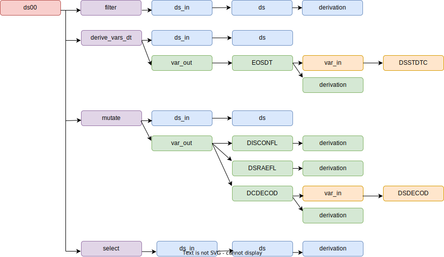

## Introduction

This project aimed to explore the feasibility of extracting variable derivations from programs. Between the initial draft and the final program, numerous modifications occurred, resulting in extensive efforts to maintain specifications consistent with the program. It is possible that the final specification file may deviate from what is actually implemented in the program. Extracting derivation metadata directly from the program could help to ensure the accuracy and precision of the metadata.

## Resources

In order to extract metadata information from a program, a parser is essential to extract each element of the program. Additionally, well-documented functions are required to interpret the elements parsed by the parser effectively. The use of R and open-source packages fulfills all these essential conditions. 

The following resources have been employed in this project:

* R parser: 
  + parser()
  + getParseData()
* Pharmaverse and  dplyr packages
* submissions-pilot3-adam:
  + <a href="adsl.txt" target="_blank"> adsl.R </a>
  + <a href="TDF_ADaM - Pilot 3 Team updated.xlsx" > Specification file </a> 


## Process Overview


## Parser
The first step is to employ a parser to extract each token from the program. This task is accomplished through the utilization of both the parse() and getParseData() functions. As a result, we obtain a dataframe containing all tokens interconnected in the program.

```{r, eval=FALSE}
ds00 <- ds %>%
  filter(DSCAT == "DISPOSITION EVENT", DSDECOD != "SCREEN FAILURE") %>%
  derive_vars_dt(
    dtc = DSSTDTC,
    new_vars_prefix = "EOS",
    highest_imputation = "n",
  ) %>%
  mutate(
    DISCONFL = ifelse(!is.na(EOSDT) & DSDECOD != "COMPLETED", "Y", NA),
    DSRAEFL = ifelse(DSTERM == "ADVERSE EVENT", "Y", NA),
    DCDECOD = DSDECOD
  ) %>%
  select(STUDYID, USUBJID, EOSDT, DISCONFL, DSRAEFL, DSDECOD, DSTERM, DCDECOD)
```

This figure illustrates the connections between all the tokens in the code above.

<a href="diag.html" target="_blank"></a>

To utilize the information extracted by the parser, an additional object must be generated. This object will serve as an input for the interpreter and takes the form of a list. This list encompasses all functions from the parsed program along with their respective arguments and argument values.


## Interpreter

For each function within packages, every argument is categorized to identify input and output datasets, as well as input and output variables and their associated derivations. 


To extract metadata from the parsed program, the list containing all the functions is processed by their respective functions. As an illustrative example, consider the code snippet below from the 'adsl.R' program.

```{r, eval=FALSE}
derive_vars_dt(
  dtc = EXENDTC,
  new_vars_prefix = "EXEN",
  highest_imputation = "Y",
  max_dates = exprs(EOSDT),
  date_imputation = "last",
  flag_imputation = "none"
) 
```


This function is passed through the interpreter, resulting in the extraction of metadata.


## Linked metadata

The extraction of metadata for datasets and variables from the parsed 'adsl.R' program is presently conducted in a function-by-function manner. As illustrated by the code example below, four functions are employed to transform 'ds' into 'ds00.' Within each of these functions, we can discern the input dataset, input variables, output variables, derivations, and accompanying code.

```{r, eval=FALSE}
ds00 <- ds %>%
  filter(DSCAT == "DISPOSITION EVENT", DSDECOD != "SCREEN FAILURE") %>%
  derive_vars_dt(
    dtc = DSSTDTC,
    new_vars_prefix = "EOS",
    highest_imputation = "n",
  ) %>%
  mutate(
    DISCONFL = ifelse(!is.na(EOSDT) & DSDECOD != "COMPLETED", "Y", NA),
    DSRAEFL = ifelse(DSTERM == "ADVERSE EVENT", "Y", NA),
    DCDECOD = DSDECOD
  ) %>%
  select(STUDYID, USUBJID, EOSDT, DISCONFL, DSRAEFL, DSDECOD, DSTERM, DCDECOD)
```




The ultimate phase involves linking datasets, variables, and derivations to achieve a complete data flow from SDTM to ADaM.


## Outcomes
### Data Flow
One of the outcomes is the visualization of the data flow from SDTM to ADaM for datasets and variables.

The graph below illustrates the connections among all the datasets used and created in 'adsl.R.'. This graph facilitates the identification of SDTM datasets and enhances the understanding of the relationships between temporary datasets.

<a href="adsl_ds_graph.html" target="_blank"></a>

The graph below illustrates the connections among all the variable used and created in 'adsl.R.'.

<a href="adsl_var_graph.html" target="_blank"></a>
<a href="adsl_var_graph.html" target="_blank"></a>

Linked variables enables the identification of the derivation pathway, encompassing all variables required for the derivation. The figure below illustrates the derivation path of AVGDD.


With linked variables, it becomes possible to assess which variables might be influenced by changes in other variables, as demonstrated here with TRTSDT.


Linked variables contributes to traceability by identifying all SDTM variables used in derivations and aids in evaluating whether they can be retained in ADaM for datapoint traceability.

### Derivation
Another outcome is the derivation extracted from the parsed 'adsl.R' program. To assess the accuracy of these derivations, we conducted a comparison with the derivation from the R Pilot 3 submission project. The detailed comparison is available in this <a href="compare Pilot3 and metadata parser.xlsx" target="_blank"> file </a>, and a more clean version is presented in the following tables.

In the specifications file from Pilot 3, a total of 36 derived variables were identified. Among them, 17 derivations are similar to the ones from the parser. For 5 variables, the derivations from the parser have a  greater precision. There are 5 instances of mismatched derivations. Additionally, 6 variables are associated with a 'transpose' function; however, the variable names could not be automatically detected, so they were manually linked to their respective derivations. Furthermore, 2 variables were found to utilize deprecated functions not present in the interpreter or the metadata from the parser. Lastly, there is one variable that relies on a user-defined function, with only the associated code extracted.

| Category                                                      | Number of Variables |
|:--------------------------------------------------------------|:---------------------:|
| Similar derivation                                            | 17                  |
| More precision from the parser                                | 5                   |
| Mismatched                                                    | 5                   |
| Variable transposed                                           | 6                   |
| Derivation using a user-defined function                      | 1                   |
| Variables not extracted by the parser due to deprecated functions | 2                   |

#### Match

```{r, echo = FALSE}
library(DT)
library(dplyr)
load(file = "compare.Rda")

columns2hide <- c("Type", "code.from.parser")

datatable(
  compare %>% 
    filter(Type == c("Match")) %>% 
    select(-all_of(columns2hide)),
  escape = FALSE,
  rownames = FALSE,
  colnames = c("Variable", "Derivation Pilot 3", "Derivation Parser"),
  options = list(
    columnDefs = list(list(width = "40%", targets = c(1, 2))),
    pageLength = 10,
    lengthMenu = c(5, 10, 15, 20),
    searching = FALSE
  )

) %>%
  formatStyle(0,
    target = "row",
    color = "black",
    backgroundColor = "white",
    fontWeight = "500",
    lineHeight = "85%",
    textAlign = "left",
    fontSize = ".875em" # same as code
  )
```


#### Transpose
Using a parser alone, it is not feasible to determine the variables that are generated when rows are transposed. This results in a broken data link, necessitating a manual intervention to establish connections between variables and their derivations.

```{r, echo = FALSE}
library(DT)
library(dplyr)

columns2hide <- c("Type", "code.from.parser")

datatable(
  compare %>% 
    filter(Type %in% c("Transpose")) %>% 
    select(-all_of(columns2hide)),
  escape = FALSE,
  rownames = FALSE,
  colnames = c("Variable", "Derivation Pilot 3", "Derivation Parser"),
  options = list(
    columnDefs = list(list(width = "40%", targets = c(1, 2))),
    pageLength = 10,
    lengthMenu = c(5, 10, 15, 20),
    searching = FALSE
  )

) %>%
  formatStyle(0,
    target = "row",
    color = "black",
    backgroundColor = "white",
    fontWeight = "500",
    lineHeight = "85%",
    textAlign = "left",
    fontSize = ".875em" # same as code
  )
```


#### Precision
In the derivations obtained from the parser, we sometimes notice greater precision. For instance, consider the variable 'ITTFL.' 
In the Pilot 3 specifications, it is defined as Y if ARMCD ne ' '. N otherwise
However, from the parser, it is defined as Y if ARMCD ne ' ' and ARMCD ne "Scrnfail", Null if ARMCD eq "Scrnfail", N otherwise


```{r, echo = FALSE}
library(DT)
library(dplyr)

columns2hide <- c("Type", "code.from.parser")

datatable(
  compare %>% 
    filter(Type %in% c("Precision")) %>% 
    select(-all_of(columns2hide)),
  escape = FALSE,
  rownames = FALSE,
  colnames = c("Variable", "Derivation Pilot 3", "Derivation Parser"),
  options = list(
    columnDefs = list(list(width = "40%", targets = c(1, 2))),
    pageLength = 10,
    lengthMenu = c(5, 10, 15, 20),
    searching = FALSE
  )

) %>%
  formatStyle(0,
    target = "row",
    color = "black",
    backgroundColor = "white",
    fontWeight = "500",
    lineHeight = "85%",
    textAlign = "left",
    fontSize = ".875em" # same as code
  )
```


#### Mismatch
In certain instances, discrepancies exist between the derivations in the specifications and those obtained from the parser. In such cases, it is valuable to determine whether updates should be made to the specifications or the program.

For instance, consider the variable 'TRTSDT,' which relies on visit dates from the 'SV' domains in the specifications. However, in the program, it utilizes 'EX date' to derive the treatment start date.

```{r, echo = FALSE}
library(DT)
library(dplyr)

columns2hide <- c("Type", "code.from.parser")

datatable(
  compare %>% 
    filter(Type == "Mismatch" ) %>% 
    select(-all_of(columns2hide)),
  escape = FALSE,
  rownames = FALSE,
  colnames = c("Variable", "Derivation Pilot 3", "Derivation Parser"),
  options = list(
    columnDefs = list(list(width = "40%", targets = c(1, 2))),
    pageLength = 10,
    lengthMenu = c(5, 10, 15, 20),
    searching = FALSE
  )

) %>%
  formatStyle(0,
    target = "row",
    color = "black",
    backgroundColor = "white",
    fontWeight = "500",
    lineHeight = "85%",
    textAlign = "left",
    fontSize = ".875em" # same as code
  )
```

## Advantages
### Data Flow
* Identification of input SDTM or ADaM domains.
* Visualization of the derivation path.
* Assessment of the impact on other variables when a variable changes.
* Enhanced data point traceability, including the retention of variables used for derivation in ADaM.
* Detection of variables that are derived but never used in the final ADaM.

### Derivation
* More precise derivation metadata.
* More consistent specifications and program derivations.
* Extraction of the code used to derive a variable, enabling tracking of code changes specific to a variable and verification of spec updates when the program is modified.

## Challenges
* As this parser interprets R functions from R packages, it is essential for the parser to align with the package version, manage deprecated functions, and accommodate changes in function parameters.
* Describing all the functions of a package can be a time-consuming task.
* The transposition of datasets can break the link between variables because the parser may not be able to identify the variables created by the transpose function.
* How to extract information when the program includes user-defined functions?

```{r, eval=FALSE}

format_bmiblgr1 <- function(BMI) {
  case_when(
    BMI < 25 ~ "<25",
    BMI < 30 ~ "25-<30",
    BMI >= 30 ~ ">=30",
    TRUE ~ NA_character_
  )
}

# BMI
adsl13 <- adsl12 %>%
  mutate(
    HEIGHTBL = round(HEIGHTBL, digits = 1),
    WEIGHTBL = round(WEIGHTBL, digits = 1),
    BMIBL = round(WEIGHTBL / ((HEIGHTBL/100)**2), digits = 1),
    BMIBLGR1 = format_bmiblgr1(BMIBL)
         )
```

* Managing various programming styles and approaches can be complex:
  * ```adsl07[, "TRT01AN"] <- adsl06[, "TRT01PN"]```
  * ```adsl07 <- mutate(adsl06, TRT01AN = TRT01PN)```
  * ```adsl07 <- adsl06 %>% mutate(TRT01AN = TRT01PN))```

